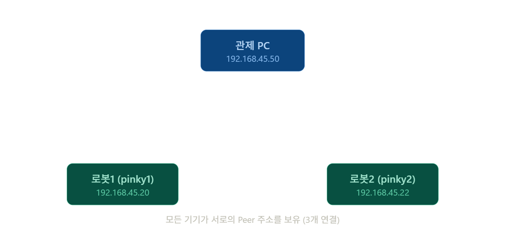
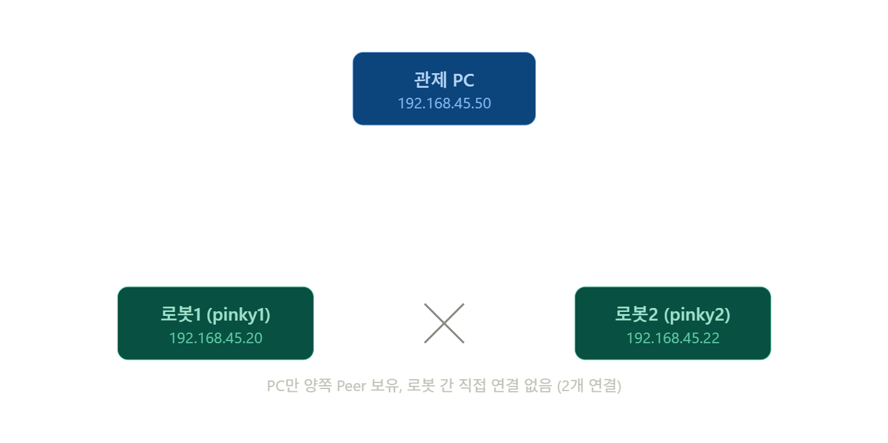

# ROS2 로봇 - 관제 PC 간 토픽 통신 불안정 트러블슈팅 레포트

> 작성일: 2026-09-17
상태: ✅ 해결 (Cyclone DDS 전환으로 통신 안정화 확인)
> 

---

## A. 문제 상황

**전제조건**

- 도메인 ID 동일
- 같은 공유기 공유
- 공유기 포트 ID 분리 (DHCP)

**증상**

1. 로봇에서 `bringup_robot.launch.xml` / `bringup_launch.xml` 을 실행
2. 관제 PC에서 **Rviz2**를 실행시켜 모니터링 시도
3. 랜덤하게 ROS 토픽을 받는 경우와 못 받는 경우가 발생 (임의로 패킷을 버림)

**원인 추정**

- 가정용/보급형 공유기의 멀티캐스트 트래픽(ROS2 DDS discovery가 사용) 처리 불안정
- Wi-Fi 공유기 단에서의 멀티캐스트 처리 오류

> 5Ghz 통신을 지원하는 공유기로 교체 후, 멀티캐스트 의존성 자체를 제거하고 유니캐스트 기반으로 전환하는 방향으로 해결을 시도함.
> 
> 
> Fast DDS 기반 Discovery Server 방식을 먼저 시도했고, 최종적으로 **Cyclone DDS + 유니캐스트 Peer 설정**으로 전환하면서 통신이 안정화됨.
> 

---

## B. AP(Access Point) 교체 및 성능비교

#### 📄 AP(Access Point) 스펙 비교

1. 기존 모델 : ipTIME N604SR
2. 변경 모델 :  SK(머큐리) GW-ME611R

ROS2/DDS 환경(다수 토픽, 멀티캐스트 디스커버리, 다량의 소형 UDP 패킷)을 기준

| 항목 | ipTIME N604SR | SK(머큐리) GW-ME611R | ROS2 관점에서의 의미 |
| --- | --- | --- | --- |
| **Wi-Fi 규격** | 802.11n (Wi-Fi 4) | Wi-Fi 6 (802.11ax) | Wi-Fi 6의 OFDMA가 다수 소형 패킷 처리에 유리 
→ 무선 연결 시 유실 완화 |
| **무선 대역** | 2.4GHz 싱글밴드 | 2.4GHz + 5GHz 듀얼밴드 | 5GHz는 간섭·경쟁이 적어 재전송/유실 감소 |
| **유선 포트 속도** | 전 포트 100Mbps(Fast Ethernet) | 기가비트급 | 100Mbps 포트는 대역폭 자체가 부족해 
대용량 토픽(카메라, 라이다 등)에서 병목 |
| **CPU/스위칭 성능** | 리얼텍 RTL8197F 600MHz, 
RAM 64MB (저사양) | 상대적으로 상위 SoC (미디어텍 MT7611 계열 추정) | CPU/ASIC 처리 여유가 초당 패킷수(PPS) 감당 능력 결정 
→ 저사양일수록 소형 패킷 폭주 시 드롭 위험 ↑ |
| **멀티캐스트(IGMP) 처리** | 스펙상 명시 없음, 
보급형 제품은 대체로 취약 | 통신사향 게이트웨이로 상대적으로 안정적 (단, 검증 필요) | DDS Discovery(SPDP/SEDP)가 멀티캐스트 사용 
→ IGMP snooping 부실 시 트래픽 폭증 또는 끊김 |
| **QoS 기능** | 지원(대역폭 기준) | 지원 | 트래픽 우선순위는 가능하나, 
패킷 유실 자체의 근본 해결책은 아님 |
| **로봇-PC 유선 직결 적합성** | 낮음(100Mbps 한계) | 높음(기가비트) | ROS2 실시간성 확보에는 유선 직결이 정석이며, 
이 경우 포트 속도가 실질적 병목 |
| **무선 사용 시 신뢰성** | 낮음(소형 패킷 폭주에 취약) | 중간~높음(Wi-Fi 6 개선) | 그래도 무선은 근본적으로 지연/유실에 취약 — 완화책일 뿐 |
| **종합 평가** | 100Mbps 이하 저부하 환경에나 적합, 
다수 토픽 환경엔 부적합 | 상대적으로 여유 있으나, 공유기 교체만으로 유실이 완전히 해결되진 않음 | DDS 소켓 버퍼, QoS(Reliable/Best Effort), 
Discovery 설정 튜닝이 병행되어야 함 |

---

## C. AP(공유기) 고정 IP 설정 — 공통 사전 작업

Fast DDS, Cyclone DDS 어느 방식을 쓰든 각 기기의 IP가 고정되어 있어야 discovery 설정(서버 주소, Peer 주소)이 끊기지 않고 유지됩니다.

- ipTIME 설정 방법:
    
    https://atnbt.com/아이피타임-고정아이피/
    
- SK 공유기 설정 방법:
    
    https://www.ajd.co.kr/contents/basic-tip/detail/SK_공유기_설정_가이드_–_관리자_페이지_접속%2C_초기화%2C_비밀번호_변경_완벽_정리-52593
    

#### 🌐 IP **Table**

| **기기** | **대분류** | **세부 항목** | **값** | **비고** |
| --- | --- | --- | --- | --- |
| **관제 PC** | 시스템 식별 | DOMAIN_ID | 50 | — |
|  | 네트워크 | 고정 IP 할당 | 192.168.45.50 / 
255.255.255.0 | SK 공유기 대역 |
|  | 네트워크 | MAC 주소 | f0:77:c3:e3:db:4f | — |
| **pinky 1** | 시스템 식별 | DOMAIN_ID | 20 | — |
|  | 공유기 연결 | 고정 IP | 192.168.45.20 / 
255.255.255.0 | SK 공유기 대역 |
|  | 네트워크 | MAC 주소 | 2c:cf:67:a8:67:b5 | — |
|  | Wi-Fi (자체 AP) | SSID | pinky_67b2 | 직접 접속용 |
|  | Wi-Fi (자체 AP) | 비밀번호 | pinkypro | — |
|  | Wi-Fi (자체 AP) | 접속 IP | 192.168.4.1 /
255.255.255.0 | 다이렉트 접속 시 |
| **pinky 2** | 시스템 식별 | DOMAIN_ID | 22 | — |
|  | 공유기 연결 | 고정 IP 할당 | 192.168.45.22 / 
255.255.255.0 | SK 공유기 대역 |
|  | 네트워크 | MAC 주소 | 2c:cf:67:e8:16:46 | — |
|  | Wi-Fi (자체 AP) | SSID | pinky_1645 | 직접 접속용 |
|  | Wi-Fi (자체 AP) | 비밀번호 | pinkypro | — |
|  | Wi-Fi (자체 AP) | 접속 IP | 192.168.4.1 / 
255.255.255.0 | 다이렉트 접속 시 |

---

## D. 시도 — Fast DDS 명시적 고정

Discovery Server 구축까지는 진행하지 않았고, 세 기기의 RMW 구현체가 서로 다를 가능성을 배제하기 위해 **Fast DDS를 명시적으로 고정**하는 작업만 수행.

세 기기(핑키1, 핑키2, 관제PC) 모두 `.bashrc`에 아래 한 줄을 동일하게 추가:

```bash
# .bashrc (pinky1 , pinky2, PC)
export RMW_IMPLEMENTATION=rmw_fastrtps_cpp
```

적용:

```bash
# Terminal (pinky1 , pinky2, PC)
source ~/.bashrc
ros2 daemon stop
ros2 daemon start
```

세 기기 모두 새 터미널을 열고 기존 launch 파일(`bringup_robot.launch.xml`, `bringup_launch.xml`, `nav2_view.launch.xml`)을 그대로 실행.

> **결과**: RMW 구현체를 Fast DDS로 통일했지만, 멀티캐스트 기반 discovery 자체는 그대로였기 때문에 근본적인 해결에는 이르지 못함. 이후 Cyclone DDS 전환으로 방향을 바꿈.
> 

---

## D. 최종 해결 — Cyclone DDS 전환 (유니캐스트 Peer 설정)

✅ **Cyclone DDS로 전환 후 통신이 안정화됨 (최종 해결 방법)**

Fast DDS와 구현 방식이 달라(멀티캐스트 처리, 리소스 사용 패턴 등) 문제가 개선되는지 확인하기 위해 전환. 최종적으로 유니캐스트 Peer 설정까지 적용하여 안정화.

### 1. 세 기기 모두 Cyclone DDS 패키지 설치

```bash
sudo apt update
sudo apt install ros-jazzy-rmw-cyclonedds-cpp
```

> ros-jazzy-rmw-cyclonedds-cpp 를 설치하기 위해서는 외부망과 접속이 되어야 함.
> 

### 2. 설치 확인

```bash
ros2 pkg list | grep cyclonedds
```

### 3. 환경변수 전환

앞서 넣었던 `RMW_IMPLEMENTATION=rmw_fastrtps_cpp` 줄을 아래로 교체 (세 기기 `.bashrc` 동일하게 수정):

```bash
export RMW_IMPLEMENTATION=rmw_cyclonedds_cpp
```

> `ROS_DOMAIN_ID`, `ROS_LOCALHOST_ONLY`, `ROS_AUTOMATIC_DISCOVERY_RANGE`는 RMW 구현체와 무관하게 공통으로 쓰이므로 그대로 유지
> 

### 4. 적용

```bash
source ~/.bashrc
ros2 daemon stop
ros2 daemon start
```

세 기기 모두 새 터미널을 열고 확인.

### 5. 기본 동작 확인

```bash
# 터미널 1 (talker) - 로봇
ros2 run demo_nodes_cpp talker

# 터미널 2 (listener, 다른 머신) - 관제 PC
ros2 run demo_nodes_cpp listener

# 주의: 도메인 ID를 맞춰서 테스트를 진행해야 함
```

### 6. 멀티캐스트 완전 제거 → 유니캐스트 Peer 직접 지정 (핵심 해결 단계)

기본 Cyclone DDS 전환만으로도 개선되었으나, 완전한 안정화를 위해 **멀티캐스트를 끄고 유니캐스트로 상대방 IP를 직접 지정**하는 설정을 최종 적용.

설정 파일 경로 (관례적으로 `~/.ros/` 하위):

```
~/.ros/
├── log/                      # ROS2 노드들이 생성하는 로그 파일 저장소
├── desc/                     # (선택) 로컬 로봇 설명(URDF 등) 임시 캐시
├── config/                   # (필요 시) 글로벌 공유 YAML 설정 파일
└── cyclonedds.xml            # Cyclone DDS 유니캐스트용 xml 파일 저장 위치
```

로봇과 PC에 각각 고정 IP가 설정되어 있어야 함 (B 항목 참고).

#### 통신 토폴리지 구분

#### **1. Mash Topology**



**pinky 1 로봇 쪽** (`~/cyclonedds_robot.xml`):

```xml
<?xml version="1.0" encoding="UTF-8" ?>
<CycloneDDS xmlns="https://cdds.io/config">
  <Domain id="any">
    <General>
      <Interfaces>
        <NetworkInterface name="wlan0" priority="default" multicast="false" />
      </Interfaces>
      <AllowMulticast>false</AllowMulticast>
    </General>
    <Discovery>
      <ParticipantIndex>auto</ParticipantIndex>
      <Peers>
        <Peer Address="192.168.45.20"/>
        <Peer Address="192.168.45.22"/>
        <Peer Address="192.168.45.50"/>
      </Peers>
    </Discovery>
  </Domain>
</CycloneDDS>
```

(자기 자신의 주소도 Peers에 포함해야 같은 터미널에서 topic list가 보임)

**pinky 2 로봇 쪽** (`~/cyclonedds_robot.xml`): pinky 1과 동일한 Peer 목록 사용

```xml
<?xml version="1.0" encoding="UTF-8" ?>
<CycloneDDS xmlns="https://cdds.io/config">
  <Domain id="any">
    <General>
      <Interfaces>
        <NetworkInterface name="wlan0" priority="default" multicast="false" />
      </Interfaces>
      <AllowMulticast>false</AllowMulticast>
    </General>
    <Discovery>
      <ParticipantIndex>auto</ParticipantIndex>
      <Peers>
        <Peer Address="192.168.45.20"/>
        <Peer Address="192.168.45.22"/>
        <Peer Address="192.168.45.50"/>
      </Peers>
    </Discovery>
  </Domain>
</CycloneDDS>
```

**PC 쪽** (`~/cyclonedds_pc.xml`):

```xml
<?xml version="1.0" encoding="UTF-8" ?>
<CycloneDDS xmlns="https://cdds.io/config">
  <Domain id="any">
    <General>
      <Interfaces>
        <NetworkInterface name="wlp0s20f3" priority="default" multicast="false" />
      </Interfaces>
      <AllowMulticast>false</AllowMulticast>
    </General>
    <Discovery>
      <ParticipantIndex>auto</ParticipantIndex>
      <Peers>
        <Peer Address="192.168.45.20"/>
        <Peer Address="192.168.45.22"/>
        <Peer Address="192.168.45.50"/>
      </Peers>
    </Discovery>
  </Domain>
</CycloneDDS>
```

#### **2. Star Topology**



**pinky 1 로봇 쪽** (`~/cyclonedds_robot.xml`) 

```xml
<?xml version="1.0" encoding="UTF-8" ?>
<CycloneDDS xmlns="https://cdds.io/config">
  <Domain id="any">
    <General>
      <Interfaces>
        <NetworkInterface name="wlan0" priority="default" multicast="false" />
      </Interfaces>
      <AllowMulticast>false</AllowMulticast>
    </General>
    <Discovery>
      <ParticipantIndex>auto</ParticipantIndex>
      <Peers>
        <Peer Address="192.168.45.20"/>   <!-- 자기 자신 -->
        <Peer Address="192.168.45.50"/>   <!-- 관제PC -->
      </Peers>
    </Discovery>
  </Domain>
</CycloneDDS>
```

**pinky 2 로봇 쪽** (`~/cyclonedds_robot.xml`) 

```xml
<?xml version="1.0" encoding="UTF-8" ?>
<CycloneDDS xmlns="https://cdds.io/config">
  <Domain id="any">
    <General>
      <Interfaces>
        <NetworkInterface name="wlan0" priority="default" multicast="false" />
      </Interfaces>
      <AllowMulticast>false</AllowMulticast>
    </General>
    <Discovery>
      <ParticipantIndex>auto</ParticipantIndex>
      <Peers>
        <Peer Address="192.168.45.22"/>   <!-- 자기 자신 -->
        <Peer Address="192.168.45.50"/>   <!-- 관제PC -->
      </Peers>
    </Discovery>
  </Domain>
</CycloneDDS>
```

**PC 쪽** (`~/cyclonedds_pc.xml`) — Star 버전 (PC는 양쪽 로봇을 모두 봐야 하므로 Peers 유지):

```xml
<?xml version="1.0" encoding="UTF-8" ?>
<CycloneDDS xmlns="https://cdds.io/config">
  <Domain id="any">
    <General>
      <Interfaces>
        <NetworkInterface name="wlan0" priority="default" multicast="false" />
      </Interfaces>
      <AllowMulticast>false</AllowMulticast>
    </General>
    <Discovery>
      <ParticipantIndex>auto</ParticipantIndex>
      <Peers>
        <Peer Address="192.168.45.22"/>   <!-- 자기 자신 -->
        <Peer Address="192.168.45.50"/>   <!-- 관제PC -->
      </Peers>
    </Discovery>
  </Domain>
</CycloneDDS>
```

- `NetworkInterface name`은 실제 사용 중인 인터페이스 이름으로 변경 (`ip a`로 확인, 보통 `wlan0` 또는 `eth0`)
- 로봇이 여러 대면 PC의 `<Peers>` 안에 각 로봇 IP를 추가

**IP / 인터페이스명 조회**

```bash
# 핑키 쪽 IP 확인
hostname -I
# 또는
ip addr show wlan0

# 관제PC 무선 인터페이스명 확인
ip a
```

`state UP`이고 `inet 192.168.45.x`가 붙어있는 인터페이스가 정답 (보통 `wlan0`, 노트북 내장 카드는 `wlp2s0`, `wlx...` 등으로 표기).

**환경변수로 적용**

핑키1, 핑키2:

```bash
# .bashrc 추가
export CYCLONEDDS_URI=file:///home/$USER/.ros/cyclonedds_robot.xml
```

```bash
# Terminal 실행
source ~/.bashrc
echo $CYCLONEDDS_URI    # 확인
```

관제PC:

```bash
# .bashrc 추가
export CYCLONEDDS_URI=file:///home/$USER/.ros/cyclonedds_pc.xml
```

```bash
source ~/.bashrc
echo $CYCLONEDDS_URI    # 확인
```

### 7. 검증 도구

CycloneDDS 자체 성능 테스트 (ROS 없이 순수 네트워크 상태 확인):

```bash
ddsperf sanity   # 로봇, PC 양쪽에서 각각 실행
```

`mean` 값이 100000us(100ms) 이상이면 네트워크 자체 문제로 판단 가능.

ROS2 멀티캐스트 테스트:

```bash
# PC
ros2 multicast receive

# 로봇
ros2 multicast send
```

디버그 로그 활성화 (문제 재현 시 로그 확보용):

```bash
export CYCLONEDDS_URI='<CycloneDDS><Domain><Tracing><Verbosity>trace</Verbosity><Out>/var/log/cyclonedds.${CYCLONEDDS_PID}.log</Out></Tracing></Domain></CycloneDDS>'
```

---

## E. 결과 검증 — AP Network Traffic 수집 툴

Cyclone DDS 전환 후 실제 안정화 여부를 정량적으로 확인하기 위해 사용한 진단 스크립트 사용.

**Log 수집 프로그램**: `ros2_net_diag_v2.sh`

</aside>

**실행 절차**

```bash
cd ~/Downloads    # 스크립트 위치로 이동
source /opt/ros/jazzy/setup.bash
chmod +x ros2_net_diag_v2.sh

./ros2_net_diag_v2.sh 192.168.45.20 0.1 30 wlan0 "/scan,/tf,/map,/odom"  # pinky1
./ros2_net_diag_v2.sh 192.168.45.22 0.1 30 wlan0 "/scan,/tf,/map,/odom"  # pinky2
```

참고 형식:

```
./ros2_net_diag.sh [핑키_IP] [부하Hz] [지속시간(분)] [관제PC의_무선인터페이스명]
```

**IP / 인터페이스명 조회**

```bash
# 핑키 쪽 IP 확인
hostname -I
# 또는
ip addr show wlan0

# 관제PC 무선 인터페이스명 확인
ip a
```

`state UP`이고 `inet 192.168.45.x`가 붙어있는 인터페이스가 정답 (보통 `wlan0`, 노트북 내장 카드는 `wlp2s0`, `wlx...` 등으로 표기).

**로그 분석 결과**

| 항목 | FastDDS + 공유기 | Cyclone DDS + 고정IP + Star |
| --- | --- | --- |
| 측정 로그 | pinky20·pinky22, 짧은(1.5~1.7분) + 20분 | pinky1·pinky2, 짧은(2.4분) + 11.5분 |
| 합산 관측 시간 | 약 43.2분 (4개 로그) | 약 13.9분 (2개 로그) |
| 합산 ping 수 / 손실률 | 2,408개 / 5.3% 손실 | 805개 / 0.0% 손실 |
| 평균 RTT | 33.8 ms | 8.2 ms |
| p95 RTT | 135 ms | 18.8 ms |
| 최대 RTT | 946 ms | 492 ms |
| 최대 노드 수 도달 | 28개 (약 1분 내 도달) | 28개 (약 2분 내 도달) |
| 노드 디스커버리 안정성 | 1~14분: 24~28개 사이 요동 
→ 14~15분: 0개로 영구 붕괴, 이후 회복 없음 | 관측 구간(11.5분) 내 붕괴 없음, 28개 유지 |
| 붕괴 시 ICMP(ping) 상태 | 정상 작동(손실률 오히려 감소) 
→ 멀티캐스트/디스커버리만 죽음 | 해당 없음 (붕괴 미관측) |
| rcl 컨텍스트 오류 건수 | 22건 (짧은 2건 + 20분 20건) | 26건 (짧은 0건 + 11.5분 26건) |
| CPU load1 추이(장시간) | 0.6 → 3.0 (최대 6.5), 안정적 | 11.2 → 16.5 (최대 19.0), 지속 상승 |
| 메모리 사용률 추이(장시간) | 34~39% (최대 42%), 안정적 | 62.8% → 72.2% (최대 73.1%), 지속 상승 |
| 토픽(/odom, /scan, /tf) 처리량 안정성 | 구독 붙었다 끊겼다 반복, 창별 메시지 수 변동 큼 | 매 구간 거의 고정된 메시지 수, 매우 안정적 |

---

## F. 결론

| 항목 | 내용 |
| --- | --- |
| 최종 해결 방법 | **Cyclone DDS 전환 + 유니캐스트 Peer 설정 (`AllowMulticast=false`)** |
| 핵심 조치 | `RMW_IMPLEMENTATION=rmw_cyclonedds_cpp` + `cyclonedds.xml`에 각 기기 고정 IP를 Peer로 명시 |
| 결과 | 랜덤 패킷 드랍 현상 해소, 토픽 통신 안정화 확인 |
| 비고 | Fast DDS 고정(`RMW_IMPLEMENTATION=rmw_fastrtps_cpp`)만으로는 멀티캐스트 discovery 문제가 해소되지 않아 Cyclone DDS 전환으로 최종 해결 |
